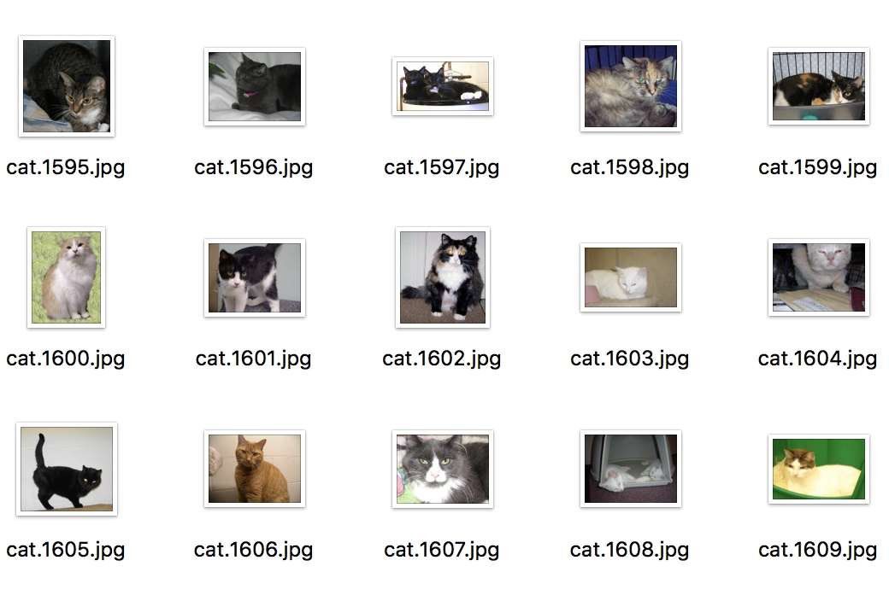
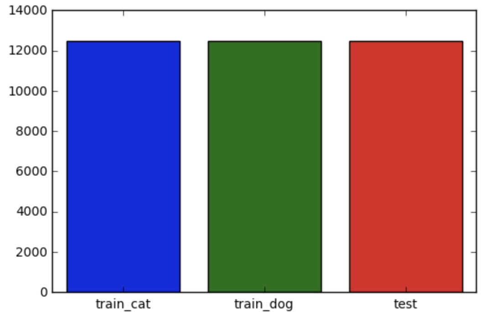
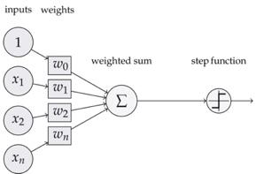

# 机器学习纳米学位——猫狗大战

张嘉
2018-04-17

## 1.定义

### 1.1 项目概览

猫狗大战（Dogs Vs. Cats）项本次项目是kaggle上的一个竞赛题目，目标是训练一个模型从给定的图片中分辨出是猫还是狗，这个是计算机视觉领域的一个问题，也是一个二分类问题。猫狗是我们日常生活中最常见两种动物，所以日常生活中也必然会留下非常多的照片，这位我们提供了良好的训练数据。

本项目中使用的模型是卷积神经网络（Convolutional Neural Network, CNN）是一种前馈神经网络，它的人工神经元可以响应一部分覆盖范围内的周围单元，对于大型图像处理有出色表现。

项目选择的数据集是Kaggle上竞赛提供的数据，训练集包括12500张被标记为猫和12500标记为猫的图片。测试机是包含12500未标记的图片。对于每一张测试机中的图像，模型需要预测出是狗图像的概率（1 代表狗，0 代表猫）。Kaggel中也有很多有很多人对这个项目提供了不一样的方法，对我有一定的参考作用。

在这个项目中我会建立一个神经网络分类器来对猫狗的照片进行分类。

### 1.2 问题说明

项目需要识别出猫狗，本质上是二分类问题。对应于监督学习就是使用现有的标签的图片训练模型，完成训练后对没有标签的图片进行分类。因此也可以使用监督学习方法如SVM解决此问题。项目要求使用深度学习方法识别一张图片是猫还是狗，通过训练模型，任意一张测试的图片，模型总能将输入数据映射为是猫或者狗的概率。

整个处理过程大概如下:

##### 数据预处理
* 从kaggle下载好图片
* 为keras.ImageDataGenerator准备数据，要求猫和狗在不同的文件夹以示分类
* 对图片进行resize，保持输入图片信息大小一致
* 对训练数据进行随机偏移、转动等变换图像处理，这样可以尽可能让训练数据多样化

##### 模型搭建
Kera的应用模块Application提供了带有预训练权重的Keras模型，这些模型可以用来进行预测、特征提取和微调整和。

* 使用ResNet50等现有的去掉了全连接层预训练模型
* 添加自己的全连接层到ResNet50网络

##### 模型训练&模型调参

* 导入预训练的网络权重
* 冻结除了全连接成的所有层，获得bottleneck特征 
* 尝试使用不同的优化器 adam,adadelta等对模型进行训练，选择最佳模型


### 1.3 指标
在kaggle的比赛中提出了标准的评价公式，采用对数损失来衡量
公式如下：

$$ LogLoss = -\frac{1}{n}\sum_{i=1}^n [y_ilog(\hat{y}_i)+(1-y_i)log(1- \hat{y}_i)]$$
其中：

* $n$ 是图片数量
* $\hat{y}_i$是模型预测为狗的概率
* $y_i$是类别标签，1 对应狗，0 对应猫
* $log()$ 表示自然对数

对数损失越小，代表模型的性能越好。上述评估指标可用于评估该项目的解决方案以及基准模型。

<br><br><br><br><br><br>
## 2.分析
### 2.1 探索性可视化
从kaggle下载的数据集中包含了两个文件，`test.zip` and `train.zip`。`train.zip`里面包含了12500猫的照片和12500张狗的照片,每张照片的文件名中都包含有dog或者cat的标签。`test.zip`里有有12500张照片，文件名中没有标签。




上图是训练集的照片都，是日常生活中的随手拍的照片。拍摄手法随意，而且图片的背景非常的负责。


而且在训练集中存在很多很抽象或者根本就是错误的标签照片，对我的程序形成很大的干扰。


在测试集中同样会有些效果比较差。如126,没有动物的面部图像，就是人类也不能直接从照片中看出是猫还是狗，5292和7999都是有网格阻挡，而5302照片中会有一些多余的文字信息。这些都是对我的图像分类器形成相当大的挑战。


数据集中 `image/train/`里的猫狗没有分类，放在一个文件夹，因为需要使用keras，需要将训练照片按照类别文件夹分类，其中猫放在一个文件夹，狗放在一个文件夹
my_train 里面包含两个文件夹，一个是cat，一个是dog


``` python 
├── image
│   ├── img_test 
│   │   └── test  [12500zhang]
│   ├── img_train [合计20000张]
│   │   ├── cat
│   │   └── dog
│   ├── img_valid [合计5000张]
│   │   ├── cat
│   │   └── dog
```


| |  | 
| --- |---|
| 原始数据集 | 划分训练集验证集的数据集 | 


### 2.2 算法与方法
#### 2.2.1 深度学习&神经网络简介

**深度学习（deep learning）**是机器学习的分支.深度学习的概念源于人工神经网络的研究。含多隐层的多层感知器就是一种深度学习结构。深度学习通过组合低层特征形成更加抽象的高层表示属性类别或特征，以发现数据的分布式特征表示。

深度学习的概念由Hinton等人于2006年提出。基于深度置信网络(DBN)提出非监督贪心逐层训练算法，为解决深层结构相关的优化难题带来希望，随后提出多层自动编码器深层结构。此外Lecun等人提出的卷积神经网络是第一个真正多层结构学习算法，它利用空间相对关系减少参数数目以提高训练性能。

深度学习是机器学习中一种基于对数据进行表征学习的方法。观测值（例如一幅图像）可以使用多种方式来表示，如每个像素强度值的向量，或者更抽象地表示成一系列边、特定形状的区域等。而使用某些特定的表示方法更容易从实例中学习任务（例如，人脸识别或面部表情识别）。深度学习的好处是用非监督式或半监督式的特征学习和分层特征提取高效算法来替代手工获取特征。

**人工神经网络（Artificial Neural Network，即ANN ）**，是20世纪80 年代以来人工智能领域兴起的研究热点。它从信息处理角度对人脑神经元网络进行抽象， 建立某种简单模型，按不同的连接方式组成不同的网络。在工程与学术界也常直接简称为神经网络或类神经网络。神经网络是一种运算模型，由大量的节点（或称神经元）之间相互联接构成。每个节点代表一种特定的输出函数，称为激励函数（activation function）。每两个节点间的连接都代表一个对于通过该连接信号的加权值，称之为权重，这相当于人工神经网络的记忆。网络的输出则依网络的连接方式，权重值和激励函数的不同而不同。而网络自身通常都是对自然界某种算法或者函数的逼近，也可能是对一种逻辑策略的表达。
最近十多年来，人工神经网络的研究工作不断深入，已经取得了很大的进展，其在模式识别、智能机器人、自动控制、预测估计、生物、医学、经济等领域已成功地解决了许多现代计算机难以解决的实际问题，表现出了良好的智能特性。


我们先了解一下神经元。神经元的结构如下图，也叫做感知机。
<div align = center>
 
感知机结构图

</div>

一个感知机包含如下部分：
输入权值（inputs），一个感知机可以接受多个输入$(x_1,x_2,x_3,...,x_n)$在每个输入上又一个权值  ，此外还有一个偏置项 ,也就是上图的激活函数感知器的激活函数可以有很多选择，比如我们可以选择下面的阶跃函数$f(x)$ 来作为激活函数：

[待更改]

$$ LogLoss = -\frac{1}{n}\sum_{i=1}^n [y_ilog(\hat{y}_i)+(1-y_i)log(1- \hat{y}_i)]$$
		
输出，感知机的输出有如下公式来计算：

$$ y=f(w*x+b)$$
	
深度学习使用的是神经网络模型，神经网络其实是按照一定规则连接起来的多个神经元。
<div align = center>


</div>
如上图所示：

-	神经元按照层来布局，最左侧叫输入层（input layer），负责接收输入数据；最右边的层叫输出层（output layer），我们可以从这层获取神经网络的输出数据。输入层和输出层之间的层叫做隐藏层（hidden layer），因为他对外部调用者来说是不可见的。
-	同一层之间的不同神经元没有连接。
-	第N层每个神经元和低N-1 层所有的神经元相连（Full Connected），第N-1 层神经元的输出就是低N层神经元的额输入
-	每一个连接都有一个权值


#### 2.2.2 卷积神经网络&基本原理
**卷积神经网络（Convolutional Neural Network, CNN）**是一种前馈神经网络，它的人工神经元可以响应一部分覆盖范围内的周围单元，对于大型图像处理有出色表现。

卷积神经网络由一个或多个卷积层和顶端的全连通层（对应经典的神经网络）组成，同时也包括关联权重和池化层。这一结构使得卷积神经网络能够利用输入数据的二维结构。与其他深度学习结构相比，卷积神经网络在图像和语音识别方面能够给出更好的结果。这一模型也可以使用反向传播算法进行训练。相比较其他深度、前馈神经网络，卷积神经网络需要考量的参数更少，使之成为一种颇具吸引力的深度学习结构。


#### 2.2.3 ResNet50以及迁移学习

分类器的基础架构是ResNet50（Deep Residual NetWorks），这个模型是一个50层的神经网络结构。ResNet50是由Kaiming He 和他的团队发明的，并且一举拿下2015年Imagenet比赛冠军。

### 2.3 基准测试
依据这个项目的考核标准。需要获得kaggle比赛前10%的成绩，在Kaggle的竞赛页面中，截止目前提交成绩人数为1314名。前10%则意味着分数要超过131名，在页面中可以看到第131名的得分为0.06127

基准模型指标得分需要小于0.06127

## 3.1 方法
### 3.1.1 数据预处理
清楚记录了所有预处理步骤。纠正了需要解决的数据或输入异常或特征。如果没有必要进行数据处理，则需要给出合理的理由。

### 3.1.2 实施
已完整记录了使用指定数据集或输入数据实施指标、算法和方法的过程。讨论了编码过程中发生的复杂状况。

### 3.1.3 改进
清楚记录根据算法和实现上进行改进的过程。报告最初和最终解决方案，如有中间解决方案也请写明。

记录使用 优达学城官方提供的方法

## 结果
### 模型评估与验证
最终模型质量（例如参数）会得到细致评估。我们需要借助某些分析类型验证模型解决方案的稳健性。
### 理由
使用某些统计分析类型将最终结果与基准测试结果或阈值进行对比。解释最终模型和解决方案是否足以解决问题。

## 结论
### 自由形态的可视化
经过充分讨论，提供了强调项目重要质量指标的可视化图表。明确定义了可视化曲线。
### 思考
学生充分总结端到端问题的解决方案，并讨论他们认为有趣或困难的项目的一两个特定方面。

### 改进
讨论如何改进某方面的实施。考虑通过这些改进可能解决的问题，并将改进后的解决方案与当前解决方案进行对比。


### 参考文献

[1] B. Zhou, A. Khosla, A. Lapedriza, A. Oliva, and A. Torralba. Learning Deep Features for Discriminative Localization. CVPR'16 (arXiv:1512.04150, 2015).
[5]Kaiming He, Xiangyu Zhang, Shaoqing Ren, Jian Sun.Deep Residual Learning for Image Recognition
[6] Karen Simonyan, Andrew Zisserman. Very Deep Convolutional Networks for Large-Scale Image Recognition
[7]Christian Szegedy, Wei Liu, Yangqing Jia, Pierre Sermanet, Scott Reed, Dragomir Anguelov, Dumitru Erhan, Vincent Vanhoucke, Andrew Rabinovich. Going Deeper with Convolutions
[8] Diederik P. Kingma, Jimmy. Ba.Adam: A Method for Stochastic Optimization
[9] Matthew D. Zeiler. ADADELTA: An Adaptive Learning Rate Method
 

